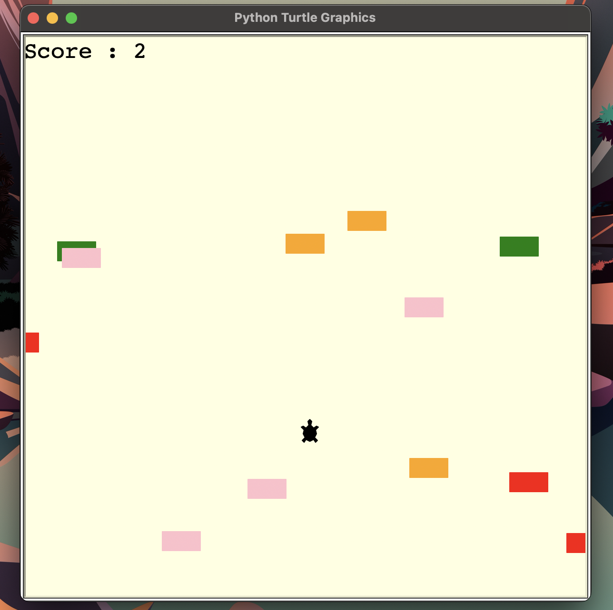

# 🐢 Turtle Crossing Game with Python

A fun little game made while practicing Object-Oriented Programming (OOP).


---

## 📦 Modules Used

- `turtle` (built-in Python graphics module)
- `time` (for delays and game loop timing)
- `random` 
---

## 🎮 Controls

- move = "arrow up"

---

## Skills demonstrated
- OOP(Object oriented programming)
    -Defined custom classes: Player, CarManager, and Scoreboard
    -Used inheritance (e.g., Player and Scoreboard inherit from Turtle)
    -Encapsulated behavior inside class methods (move, create_car, increase_score, etc.)

- Module Usage
  - Used Python built-in modules: turtle, time, random
  - Organized the code into separate Python files (modules) and imported them properly

- Game Loop and Event Handling
  - Built a game loop using while game_is_on: and time.sleep()
  - Handled keyboard input with screen.listen() and screen.onkey()

- Conditional Logic and Collision Detection
  - Used logic to:
  - Check when the player reaches the top
  - Detect collisions with cars using turtle.distance(car) < 20

- Code Organization and Readability
  - Commented your code for clarity
  - Grouped related logic into sections (screen setup, commands, game loop, etc.)
  - Defined constants at the top of files for easier tweaking

- Randomization and Dynamic Elements
  - Randomized car appearance and position
  - Used randint and choice to add variety to the gameplay

## 🛠️ Future Improvements

- Increase game speed as rounds progress  
- Add sound effects for collisions and scoring  
- Connect to a database to store high scores  
- Allow users to register with a username and password to save their highest score  

---

## ✅ Requirements

- Python 3.x  
- No external libraries needed (only built-in modules)

---

## 🚀 How to Run

1. Clone or download this repository.
2. Open a terminal or command prompt in the project directory.
3. Run the following command:

```bash
python main.py
